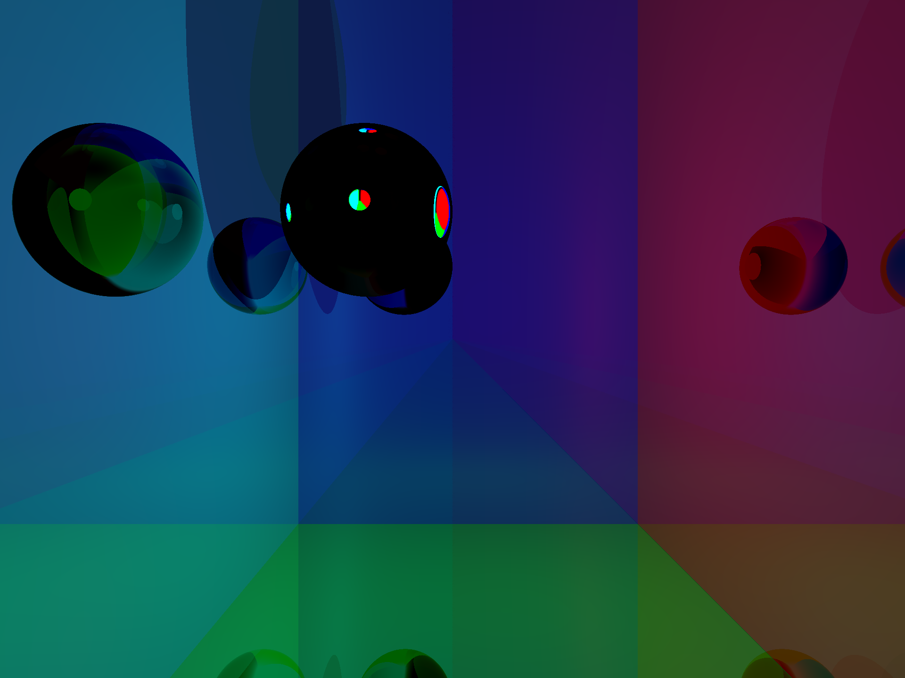

# CSC-473-Raytracer

### Program 3

For program 3, I was able to calculate almost all the reflected/refracted rays properly (minus floating point errors), but for whatever reason my pixel outputs ended up being mostly black for refractions. 
I suspect the cause is due to where the color contributions are added. I followed the Reflections/Refrations lecture pseudocode (return local_color * local_contribution + reflection_color * reflection_contribution + reflectance_color * transmission_contribution), but I still couldn't compute proper refraction colors despite having proper rays.

Just like everything else in this project, my Beer's law calculations look correct. However, there's no way for me to test that given my refractions color is broken.

The binary tree printing functionality is almost 100% there which is great. That was definitely a helpful tool for debugging.

As for triangles, I'm able to render them properly with no acne.  

My custom .pov file with my output provided (it's interesting to note that my erroneous refraction color causes the sphere to be all black, but the proper reflection color shows the warped planes on the sphere)

