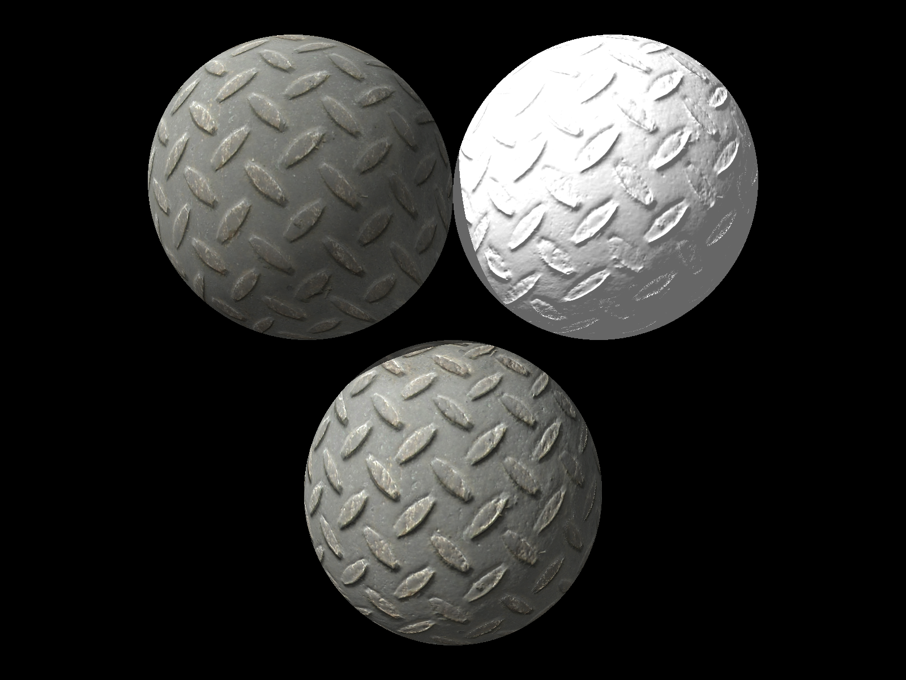

# CPU-Ray-Tracer

### Project Description
The goal of this project was to create an efficient ray tracer in C++ with many practical features. Implementation features include:
* POV-Ray file parsing
* Blinn-Phong BRDF
* Cook Torrance BRDF
* Refractions and reflections
* Object transformations
* Bounding Volume Hierarchy
* Monte Carlo global illumination
* Texture and Normal mapping
* Bilinear Interpolation
* Multithreading

# Usage
## Building
* Install [GLM](https://glm.g-truc.net/) under environment variable `GLM_INCLUDE_DIR`
* Clone project
* In project directory run `mkdir buid; cd build; cmake ..; make` or use CMake GUI to build 

## Running
Supported povray files can be found in /res/

Command line arguments: 
* `sceneinfo <input_file.pov>` - Prints out povray scene info without rendering
* `render <input_file.pov> <width> <height>` - Renders the povray scene using defined width and height
* `-out=<filename>` - Specify output image name - default is output.png
* `-fresnel` - Render scene including Fresnel reflectance
* `-ss=N` - Render scene with super sampling with NxN samples
* `-gi` - Render scene using Monte Carlo global illumination
* `-gi_samples=N` - Render scene using at most N bounces for Monte Carlo global illumination
* `-threads=N` - Specify number of threads to be used for rendering
* `-percent` - Print out per-thread percent completion

# Output

### Reflection 

### Refraction  

### Object Transformations

### Bounding Volume Hierarchy

### Monte Carlo global illumination and Multithreading
Single-threaded: 52h:34m:58s

Multi-threaded: 15h:02m:18s

### Texture mapping

### Normal mapping

### Bilinear Interpolation

### Final Project
For my final project I chose to do texture mapping. Texture mapping is a low-cost, high-reward feature in computer graphics that is conceptually straightforward, relatively simple to implement, and makes our project much more realistic.

### Software Design
Adding textures to a ray tracer isn't terribly difficult, but doing it well from a software design standpoint requires some extra functionality.

The first thing I did was I implemented what I call a TextureBatch. The TextureBatch contains a list of all the unique textures that have been loaded thus far. When my POV-Ray parser finds a texture, it first communicates with the TextureBatch to make sure that texture hasn't already been loaded. If the texture already exists, we can reference the loaded texture rather than loading it again.

As of now each texture is individualized by only its file name. I would like to implement unique ID's per texture for added security. 

The other thing I had to implement for my final project was different texture *types*. My implementation allows objects to reference color maps and normal maps. Looking ahead I may want to add bump maps or specular maps. I created a system that would allow objects to contain multiple texture types through the use of enums. This design allows me to add many different types of textures in the future.

### Research
Realistic Ray Tracing by Peter Shirley and R. Keith Morley

Ray Tracing Tutorial by The CoderMind Team

opengameart.org for color and normal map pairs

Normal Map Online for creating my own normal maps
