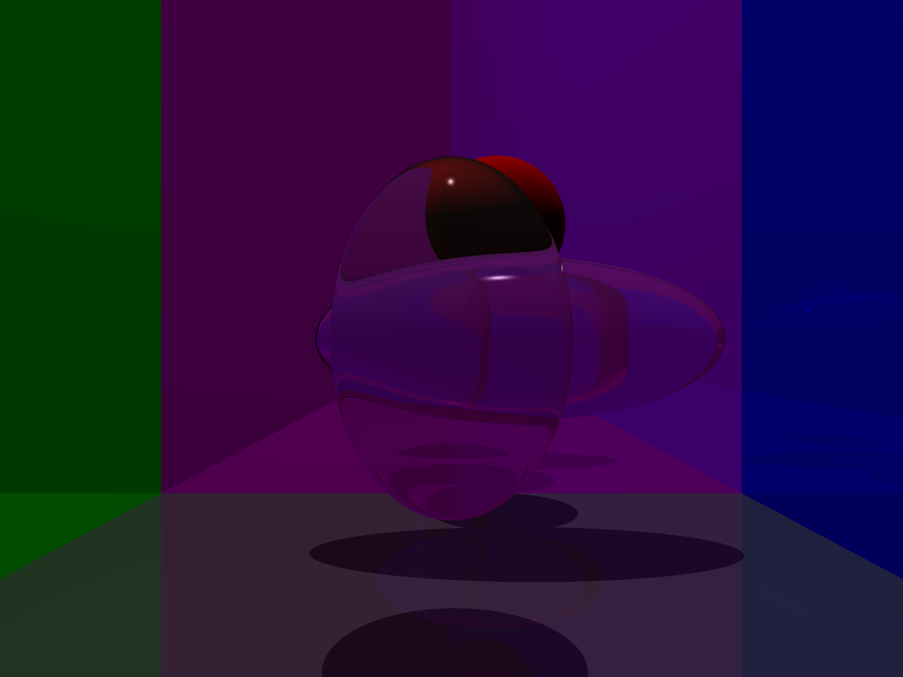

### CSC-473-Raytracer

### Program 4
Transformations look good.

Supersampling looks good.

Not entirely sure what's off about my fresnel implementation.
All my fresnel%.pov spheres have a darker ring around their edge. 
My fresnel1.pov doesn't include the specular highilght in the center of each sphere.
My fresnel3.pov lacks reflection.

